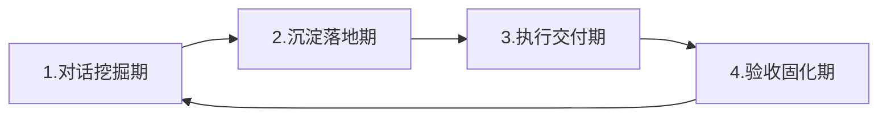
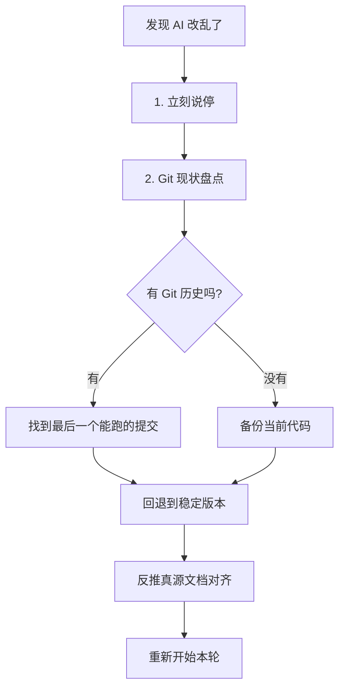

# AI 协作全流程操作手册（从立项到上线 + 反哺）

> 这份手册是 [项目可视化流程手册.md](./项目可视化流程手册.md) 的"操作细则版"。
> 可视化手册告诉你"走哪条路、每步目标是什么"；这份手册告诉你"每一步具体怎么和 AI 对话、哪些必须你深度参与、哪些可以直接让它做、文档什么时候生成怎么改"。
>
> **用法**：每个新项目启动时，打开第 0 章判断工作模式；进入某个阶段前，翻该阶段的章节照着走。

---

## 序：三条铁律（写在最前面）

1. **AI 没有记忆，文档是它的记忆**——任何规则变更必须先落文档再改代码。
2. **AI 默认动手，你要逼它先想**——能讨论清楚的就不要让它边想边写。
3. **AI 默认讨好，你要逼它给判断**——禁止"列三方案让你选"，必须给唯一推荐。

---

## 第 0 章：先选你的工作模式

### 0.1 四段式工作循环（每个阶段都走一遍）



| 段 | 谁主导 | 做什么 | 输出 |
|---|---|---|---|
| 1. 对话挖掘期 | **你主导** | 通过追问、反驳、要证据，把模糊需求挖清楚 | 讨论纪要（暂存对话里） |
| 2. 沉淀落地期 | AI 起草 + 你确认 | 把讨论结果写成文档（立项/选型/计划/真源文档） | 落盘的 .md 文件 |
| 3. 执行交付期 | AI 主导 | 按文档写代码 / 跑验收 / 修问题 | 代码 + 提交 |
| 4. 验收固化期 | 你判断 + AI 给证据 | 走验收清单、更新真源文档、Git 提交、反哺 Skill | 验收报告 + 文档同步 |

**核心原则**：第 1、4 段你必须深度参与；第 2 段你只需确认；第 3 段可以放手让 AI 做。

### 0.2 "对话挖掘" vs "直接执行" 判断标准

| 信号 | 模式 |
|---|---|
| 涉及产品方向、用户场景、功能边界、技术选型、规则定义 | 🗣️ **必须对话挖掘** |
| 涉及安全、权限、数据归属、商业模式 | 🗣️ **必须对话挖掘** |
| 涉及多个方案权衡、需要 ROI 分析 | 🗣️ **必须对话挖掘** |
| 你自己也说不清要什么 | 🗣️ **必须对话挖掘**（让 AI 反问你） |
| 已经有明确文档/规则/计划，只是落地实现 | ⚡ **可直接执行** |
| 重复性工作（建文件、改命名、批量替换、跑命令） | ⚡ **可直接执行** |
| 单一明确的 bug 修复（根因已定位） | ⚡ **可直接执行** |
| 格式化文档、整理清单、生成测试数据 | ⚡ **可直接执行** |

**一句话心法**：**判断模糊的事必须先聊，规则清晰的事才让它做。**

### 0.3 文档生成策略总表

| 文档类型 | 生成时机 | 修改方式 |
|---|---|---|
| 立项文档 | 立项阶段讨论完后**一次性生成** | 仅在大方向变更时改 |
| 技术选型文档 | 选型讨论完后**一次性生成** | 技术栈变更时改 |
| Agent 宪法 | 宪法阶段**一次性生成** | 长期原则变更时改（很少改） |
| 架构设计文档（前端/后端） | 骨架阶段讨论后**先出文档再写代码** | 边搭骨架边补细节 |
| 数据库 schema/migration | 数据库设计阶段**先出文件再建表** | 每次结构变更先改文件 |
| 真源实施文档（前端/后端/数据库） | 验收阶段**反推生成** | 每次规则变更**立即同步** |
| 实施计划（每轮） | 业务模块每轮开始前**先生成** | 边做边修订 |
| 验收报告 | 验收阶段**一次性生成** | 整改后追加 |
| Skill 库 | 项目结束 + 发现盲点时**反哺修改** | 持续迭代 |

**核心原则**：
- **"先文档后代码"**：架构、数据库、计划类——必须文档先行
- **"边做边补"**：真源实施文档——验收阶段反推，规则变更时同步
- **"一次性生成"**：立项/选型/宪法——讨论清楚后一次写完
- **"持续反哺"**：Skill 库——每个项目至少改 1 条经验

---

## 第 1 章：阶段 1 — 项目立项

### 1.1 阶段目标
把脑子里的模糊想法变成可执行的立项文档，明确第一版做什么、不做什么。

### 1.2 ⏱️ 预计工作量
2-3 轮对话，1 次文档落地，1 次 Git 提交。

### 1.3 🗣️ 对话挖掘期（你必须主导）

**核心挖掘点**（每条都要聊清楚，不能跳）：
- 项目是什么类型？面向谁？解决什么问题？
- 核心功能有哪些？数据怎么流转？商业模式是什么？
- 用户场景是什么？核心操作流程是什么？
- 第一版 MVP 边界是什么？哪些功能后面再做？哪些暂时放弃？
- 长期版本往哪里走？
- 类似产品、竞品、开源方案？差异点和机会在哪？
- **盲区追问**：权限、数据结构、状态字段、后期扩展、合规风险

**开场 prompt（直接复制）**：

```
当前阶段：项目立项，只做产品讨论和立项设计，暂时不要写代码。
你的角色：我的产品合伙人。

我想做的是：[一句话描述]
面向用户：[谁]
解决什么问题：[什么]
参考产品：[链接 / 截图，可选]

请按以下方式追问我：
1. 围绕项目类型、目标用户、核心问题逐项深挖
2. 主动指出我没想到的盲区（权限、数据结构、状态字段、后期扩展、合规风险、性能瓶颈、跨端兼容、安全边界）
3. 帮我判断第一版 MVP 该做什么、不该做什么
4. 给唯一推荐，不要列多方案让我选
5. 讨论清楚后告诉我"现在可以写立项文档了"，等我确认再写
```

**追问 prompt（AI 偷懒时用）**：

```
不要只回答我问的，要补我没问的。
特别是：[挑当前没聊到的盲区，比如"权限模型""数据归属""状态机"]——这三块你怎么看？给判断。
```

### 1.4 📝 沉淀落地期（AI 起草 + 你确认）

#### 1.4.1 功能清单拆解

讨论清楚后，先让 AI 输出详细的功能清单（不是直接写立项文档）：

```
请根据立项文档输出一份详细的功能清单，请逐个功能说明：
- 这个功能给谁用
- 需要哪些输入
- 产生什么结果
- 涉及哪些角色和权限
- 正常流程是什么
- 有哪些异常和边界情况

如果某个功能特别复杂（如角色权限系统、订单流转、支付退款、优惠叠加），请把它单独写一份文档，并在功能清单里留一个索引指过去。先不要写代码。
```

**功能拆解的三个维度**：
1. **按角色拆解**：先列清楚有哪些角色（普通用户、商家、管理员等），再看每个角色各自能做什么
2. **按业务流程拆解**：顺着一件事的流程走（如下单、支付、发货、确认收货等）
3. **按模块拆解**：把相关功能归到一起（如账号模块、商品模块、订单模块）

**复杂功能特殊处理**：
- 功能要写清楚，否则 AI 自行脑补，可能出现边界问题
- 可以和 AI 一边对功能，一边让它把功能清单写成文档，哪个功能有问题，就直接在文档上改
- 高复杂功能（如订单流转、支付退款、优惠叠加、角色权限系统）写一份专门的文档，再到功能清单里面留一个索引指过去
- 如果拿不准这个标准，将觉得难的直接拆出来

#### 1.4.2 阶段计划

功能清单确认后，让 AI 输出阶段计划：

```
请根据功能清单，把开发拆成几个大阶段：
- 第一阶段必须是一个能跑通核心流程的最小可用版本（MVP）
- 请说明每个阶段包含哪些功能
- 为什么这么排

先只给大的阶段划分，不要现在就细化到具体技术实现和详细开发计划。
```

**阶段计划原则**：
- 阶段先定大方向，细节往后放（这个时候还不确定开发框架等等细节，等确定了再去规划细节）
- 第一阶段必须是 MVP（能跑通核心流程的最小可用版本）

#### 1.4.3 文档组织

**文档组织原则**：
- 一份文档只做一件事
- 文档之间的引用关系要像线一样清楚
- 功能清单根据立项文档来
- 复杂功能从功能清单索引出去
- 阶段计划又是基于功能清单来排

#### 1.4.4 立项文档生成

讨论清楚后，**让 AI 一次性生成**立项文档（不要边写边改）：

```
现在请把刚才的讨论结果写入项目根目录的 docs/立项文档.md。
必须包含 8 项内容：
1. 项目立项说明（是什么 / 面向谁 / 解决什么问题 / 为什么值得做 / 第一版核心目标）
2. 项目核心功能和边界（第一版做什么、不做什么）
3. 产品流程和用户路径（页面怎么走、功能怎么串、数据怎么流动）
4. 数据和业务对象（用户、订单、任务、文章、商品、文件、评论、权限等）
5. 技术路线初步判断（网页 / 小程序 / App / Web MVP）
6. 项目爆点和差异点
7. 后期规划和里程碑（第一版、第二版、长期版本）
8. 验收规则（第一版做到什么程度才算完成——必须有可检查标准）

生成后让我 review，我确认后再提交。
```

### 1.5 ⚡ 执行交付期

立项阶段**没有代码执行**。唯一的"执行"是：
- 创建空项目文件夹（命名规范：英文 + 中划线）
- 在 AI IDE 里打开

### 1.6 ✅ 验收固化期

验收清单：
- [ ] 项目文件夹存在且命名规范
- [ ] 立项文档已落盘，覆盖 8 项内容
- [ ] **功能清单已拆解**（三维度：角色 / 业务流程 / 模块）
- [ ] **复杂功能已单独拆文档**（订单流转 / 支付退款 / 优惠叠加 / 权限系统）
- [ ] **阶段计划已制定**（第一阶段是 MVP，只给大方向不细化到技术实现）
- [ ] AI 明确说过"暂时不要写代码"
- [ ] 已 Git 提交：`chore: 完成项目立项`

### 1.7 📄 文档策略
**一次性生成**。立项文档是后续所有阶段的"宪法源"，不要边做边改。只有大方向变更时才修订，且必须重新走一遍挖掘期。

### 1.8 🚫 反模式
- ❌ 直接说"帮我做个项目"——AI 自由发挥
- ❌ 跳过讨论直接让 AI 创建文件、装依赖
- ❌ 立项文档只在对话里聊过没落盘
- ❌ 边写代码边补立项文档——本末倒置
- ❌ **跳过功能清单直接写代码**——AI 自由脑补边界
- ❌ **功能清单只按模块拆**——漏掉角色和业务流程维度
- ❌ **复杂功能硬塞进功能清单**——应单独拆文档 + 留索引
- ❌ **没做阶段计划就开始写代码**——不知道先做什么，MVP 跑不通
- ❌ **阶段计划直接细化到技术实现**——选型没定排细节 = 白排

---

## 第 2 章：阶段 2 — 技术选型

### 2.1 阶段目标
把技术路线钉死，不让后续摇摆。给唯一推荐，不要列多方案。

### 2.2 ⏱️ 预计工作量
1-2 轮对话，1 次文档落地，1 次 Git 提交。

### 2.3 🗣️ 对话挖掘期

**核心挖掘点**：
- 产品形态（Web / 小程序 / App / 后台）
- 部署要求（私有 / 公有 / 本地）
- 维护能力（1人 / 小团队 / 中型团队）
- 后期可能的扩展方向（影响选型弹性）
- 团队已有技术栈（优先复用，不为了新项目学新东西）

**开场 prompt**：

```
这是我的立项文档：[贴文档]
产品形态：[Web / 小程序 / App / 后台]
部署要求：[私有 / 公有 / 本地]
维护能力：[1人 / 小团队 / 中型团队]
已有技术栈偏好：[如果有，写出来]

请给出唯一推荐技术栈，不要列多个方案。说明：
- 前端框架 + UI 组件库
- 后端语言 + 框架
- 数据库
- 主要框架和 SDK
- 为什么选它们（结合我的项目情况，不要泛泛而谈）
- 为什么不选其他常见方案（至少列 3 个被淘汰方案及理由）
- 哪些情况才需要重新评估技术路线
```

**追问 prompt（AI 想甩锅时用）**：

```
你列了 A/B/C 三套让我选——这是甩锅。请基于我的项目情况给唯一推荐，并说明为什么不选另外两套。
如果三套真的差不多，说明选型维度不够，请补充维度后重新判断。
```

### 2.4 📝 沉淀落地期

```
请把刚才的选型结论写入 docs/技术选型文档.md。
结构：前端 / 后端 / 数据库 / SDK / 选的理由 / 不选其他方案的理由 / 重评估条件。
不要在文档里留"建议方案"或"可选方案"——只写最终决定。
```

### 2.5 ⚡ 执行交付期

本阶段无代码执行。但可以让 AI 验证选型可行性：

```
请验证这套技术栈的可行性：
1. 各组件之间是否兼容（版本是否对得上）
2. 关键依赖是否还在维护（查最新 release 时间）
3. 是否有已知重大问题或替代方案推荐
不要写代码，只给结论。
```

### 2.6 ✅ 验收固化期
- [ ] 技术选型文档已落盘
- [ ] AI 能说清"为什么不选其他方案"
- [ ] 已 Git 提交：`chore: 确定项目技术栈`

### 2.7 📄 文档策略
**一次性生成**。技术栈一旦定下就不轻易改。如需变更，必须重新走挖掘期并更新文档。

### 2.8 🚫 反模式
- ❌ 让 AI 列 3 套方案让你选
- ❌ 不说明"为什么不选其他方案"
- ❌ 选型文档只写选什么，不写不选什么

---

## 第 3 章：阶段 3 — Agent 宪法

### 3.1 阶段目标
给 AI 立长期规矩，让它在后续每个阶段稳定不漂移。

### 3.2 ⏱️ 预计工作量
1-2 轮对话，1 次文档落地，1 次 Git 提交。

### 3.3 🗣️ 对话挖掘期

**核心挖掘点**：
- 项目专属规则（命名、目录、错误码、返回格式）
- 禁止事项（不要做什么）
- 验收标准（每轮交付的硬要求）
- 哪些必须用框架能力、不允许自造
- 长期原则 vs 临时规则（宪法只写长期原则）

**开场 prompt**：

```
当前阶段：Agent 宪法创建。暂时不要写业务代码。
你的角色：项目架构顾问。

上下文：
- 立项文档：[贴]
- 技术选型文档：[贴]

请帮我起草 AGENT_CONSTITUTION.md。要求：
1. 短：不超过 200 行，AI 能一次读完
2. 硬：每条都是必须遵守的硬规则，不写"建议""尽量"
3. 清楚：每条能直接判断对错
4. 只写长期原则，不写具体技术细节（目录结构、字段命名等放真源文档）
5. 必须包含：项目专属条款 / 禁止事项 / 验收标准 / 框架优先原则

先列大纲让我确认，确认后再写完整版。
```

**追问 prompt**：

```
请检查每条规则：
1. 这条是长期的吗？只在当前阶段有效的不要写进来
2. 这条能直接判断对错吗？模糊的请改写或删除
3. 这条和真源文档会不会重复？重复的请移到真源文档
4. 项目专属条款够不够？至少补 5 条本项目特有的约束
```

### 3.4 📝 沉淀落地期

```
请写入 AGENT_CONSTITUTION.md，并在各 IDE 入口文件引用它：
- AGENTS.md（Codex）
- CLAUDE.md（Claude Code）
- .trae/rules/project.md（Trae）

入口文件只写一行引用，不复制内容（避免多处不同步）。
```

### 3.5 ⚡ 执行交付期

无业务代码。仅创建配置文件。

### 3.6 ✅ 验收固化期
- [ ] 宪法不超过 200 行
- [ ] 含项目专属条款 ≥ 5 条
- [ ] 含禁止事项、验收标准
- [ ] 各 IDE 入口文件已创建并引用宪法
- [ ] 已 Git 提交：`chore: 创建项目 Agent 宪法`

### 3.7 📄 文档策略
**一次性生成 + 长期不变**。宪法是稳定锚点，规则细则放真源文档。如需改宪法，必须重新走挖掘期。

### 3.8 🚫 反模式
- ❌ 把所有技术细节、目录结构塞进宪法
- ❌ 写"建议""尽量"这种软规则
- ❌ 入口文件复制宪法内容（多处会不同步）

---

## 第 4 章：阶段 4 — 前端骨架

### 4.1 阶段目标
在写页面前把统一规则定下来：设计 token、组件库、目录规则。本轮只搭最小可运行骨架。

### 4.2 ⏱️ 预计工作量
2-3 轮对话，1 次文档落地，1-2 次代码提交。

### 4.3 🗣️ 对话挖掘期

**核心挖掘点**：
- 设计 token（颜色、字号、间距、圆角、阴影）—— 这决定后续所有页面一致性
- UI 组件库选型（结合技术选型，不要重复造轮子）
- 目录结构规则（pages / components / api / utils / store 怎么分）
- 路由结构（基于文件还是配置）
- 状态管理方案（什么时候用全局、什么时候用局部）
- 接口层封装规则（请求拦截、错误处理、loading）
- 多端适配策略（如果涉及小程序 / H5 / App）

**开场 prompt**：

```
当前阶段：前端骨架搭建。本轮只搭最小可运行骨架，不写业务页面。
你的角色：前端架构顾问。

上下文：
- 立项文档：[贴]
- 技术选型文档：[贴]
- Agent 宪法：[贴]

请先输出《前端架构实施计划》，包含：
1. 设计 token 定义（颜色 / 字号 / 间距 / 圆角 / 阴影，给具体值）
2. UI 组件库选择（结合技术栈，给唯一推荐）
3. 目录结构规则（每个目录的职责边界）
4. 路由方案（基于文件 / 配置，理由）
5. 状态管理方案（全局 / 局部边界）
6. 接口层封装规则（请求 / 响应 / 错误 / loading）
7. 多端适配策略（如适用）
8. 本轮交付清单（最小可运行：能启动 / 首页能打开 / token 已定 / 组件库接入）
9. 本轮不做什么

我确认计划后再开始写代码。
```

**追问 prompt**：

```
设计 token 还缺：暗色模式 / 响应式断点 / 字号阶梯（h1-h6 + body + caption）。
目录结构请补：每个目录放什么、不放什么、命名规则。
接口层请补：错误码统一处理规则、token 自动续期、超时重试策略。
```

### 4.4 📝 沉淀落地期

```
请把刚才的计划写入 docs/前端架构实施文档.md。
后续每次规则变更都要同步这份文档。
```

### 4.5 ⚡ 执行交付期（AI 主导）

文档确认后，可以让 AI 直接执行：

```
现在按文档搭骨架。本轮范围锁死：
- 项目能启动
- 首页能打开（一个空白页或占位页即可）
- 设计 token 已定义并生效
- UI 组件库已接入（能用一个 Button 验证）
- 目录结构按文档创建（空目录也建出来，带 .gitkeep）
- 路由结构搭好（首页路由 + 一个示例路由）
- 接口层封装好（写一个示例请求验证）

不要写业务页面。不要一次性做完所有功能。
完成后按验收清单自检，每项给证据。
```

### 4.6 ✅ 验收固化期
- [ ] 项目能启动（给启动命令和成功输出）
- [ ] 首页能打开（给浏览器截图或 URL）
- [ ] 设计 token 已定义（给文件路径 + 关键变量列表）
- [ ] UI 组件库接入（给一个使用示例）
- [ ] 目录结构符合文档（给目录树）
- [ ] 路由结构搭好（给路由配置文件）
- [ ] 接口层封装完成（给示例请求代码）
- [ ] 已 Git 提交：`feat: 搭建前端最小可运行骨架`
- [ ] 同步前端架构实施文档（如有调整）

### 4.7 📄 文档策略
**先文档后代码 + 边做边补**。骨架搭建过程中如果发现文档没覆盖的细节（比如多端适配的具体规则），改完代码立即补进文档。

### 4.8 🚫 反模式
- ❌ 一次性做完所有页面
- ❌ 到处手写组件不接入 UI 库
- ❌ 设计 token 没定就开始写页面（后续改不动）
- ❌ 接口层每个页面单独写（不复用封装）

---

## 第 5 章：阶段 5 — 数据库设计

### 5.1 阶段目标
先设计文件再建表，不直接连库建表。三大范式必校验。

### 5.2 ⏱️ 预计工作量
2-3 轮对话，1 次文档落地，1 次代码提交。

### 5.3 🗣️ 对话挖掘期

**核心挖掘点**：
- 业务对象清单（用户、订单、任务、文章……）
- 对象关系（1:1 / 1:N / N:N）
- 核心字段（每个对象的字段 + 类型 + 约束）
- 状态字段定义（订单状态、用户状态等枚举值）
- 软删除策略（哪些表软删、字段名、默认值）
- 时间字段规则（created_at / updated_at / deleted_at）
- 密码 / 敏感数据哈希策略
- 金额字段类型（必须 decimal，禁止 float）
- 索引策略（哪些字段常查询、常关联）
- 后期扩展预留（分表 / 分库 / 多租户）

**开场 prompt**：

```
当前阶段：数据库设计。先出设计文件，确认后再建表。
你的角色：数据库架构师。

上下文：
- 立项文档：[贴业务对象部分]
- 技术选型文档：[贴数据库部分]
- Agent 宪法：[贴数据相关条款]

请按以下顺序推进，每步等我确认再进下一步：

第 1 步：业务对象清单 + 关系图
- 列出所有业务对象
- 标注对象间关系（1:1 / 1:N / N:N）
- 用 Mermaid ER 图可视化

第 2 步：核心表设计
- 每张表的字段（名称 / 类型 / 约束 / 默认值 / 注释）
- 主键 / 外键 / 唯一索引 / 普通索引
- 状态字段的枚举值
- 软删除字段
- 时间字段

第 3 步：三大范式校验
- 1NF：字段原子性
- 2NF：消除部分依赖
- 3NF：消除传递依赖
- 反范式设计需说明理由 + 同步策略

第 4 步：生成 schema.sql / migration 文件
- 不要直接连库建表
- 文件路径：db/schema.sql 或 migrations/

每步给完让我 review，确认后再进下一步。
```

**追问 prompt**：

```
请主动检查盲区：
1. 金额字段是不是 decimal？（不是就改）
2. 密码字段是不是哈希存储？（不能明文）
3. 软删除字段是否一致（统一 deleted_at，不要混用 is_deleted）
4. 状态字段枚举值是否完整（覆盖所有业务状态）
5. 索引是否覆盖高频查询（外键、状态、时间）
6. 是否有 N:N 关系漏了中间表
7. 时间字段时区策略
8. 字符集是否统一 utf8mb4
```

### 5.4 📝 沉淀落地期

```
请把设计结果写入 docs/数据库设计文档.md，并生成 db/schema.sql。
文档结构：业务对象 / 关系图 / 核心表 / 字段规范 / 软删除策略 / 三大范式校验 / 索引策略。
schema.sql 必须可独立执行（不依赖手动操作）。
```

### 5.5 ⚡ 执行交付期

```
现在执行 schema.sql 建表。
本轮范围：能连接数据库 / 能建表 / 能插入和查询测试数据。
不要写业务逻辑。不要改前端。
完成后给：
- 连接证据（命令 + 输出）
- 建表证据（SHOW TABLES 输出）
- 测试数据证据（INSERT + SELECT 输出）
```

### 5.6 ✅ 验收固化期
- [ ] schema.sql 文件已落盘且可独立执行
- [ ] 数据库设计文档已落盘
- [ ] 三大范式校验通过（反范式有理由 + 同步策略）
- [ ] 金额字段用 decimal
- [ ] 密码字段哈希存储
- [ ] 软删除字段一致
- [ ] 能连接 / 能建表 / 能插入查询
- [ ] 已 Git 提交：`feat: 完成数据库设计文件并跑通基础结构`
- [ ] 同步数据库设计文档

### 5.7 📄 文档策略
**先文档后代码**。schema 文件本身就是文档的一部分。后续每次结构变更必须先改 schema 文件 + 设计文档，再执行迁移。

### 5.8 🚫 反模式
- ❌ 直接连库建表（不可回溯）
- ❌ 密码明文存储
- ❌ 金额用 float
- ❌ 状态字段用数字不注释含义
- ❌ 跳过范式校验

---

## 第 6 章：阶段 6 — 后端骨架

### 6.1 阶段目标
先写架构文档再搭骨架，避免规则漂移。骨架要跑通启动线 / 接口线 / 业务线 / 运维线四条线。

### 6.2 ⏱️ 预计工作量
3-4 轮对话，2 次文档落地，2 次代码提交。

### 6.3 🗣️ 对话挖掘期

**核心挖掘点**：
- 语言框架版本 + 启动方式
- 目录责任表（每个目录放什么、不放什么）
- 接口响应规则（统一格式、错误码、分页）
- 错误处理规则（异常捕获、日志、返回）
- 日志规则（级别、格式、关键操作必记）
- 数据库连接规则（连接池、事务边界）
- 权限入口（中间件 / 装饰器 / 注解）
- 框架复用边界（哪些必须用框架、哪些可自封装）
- 新增模块规则（一个新模块要改哪些地方）
- 启动证据包（怎么证明骨架跑通了）

**开场 prompt**：

```
当前阶段：后端骨架搭建。必须先有《项目架构设计文档》再写代码。
你的角色：后端架构师。

上下文：
- 立项文档：[贴]
- 技术选型文档：[贴]
- 数据库设计文档：[贴]
- Agent 宪法：[贴]

请先输出《项目架构设计文档》草稿，包含：
1. 语言框架（版本 + 启动命令）
2. 目录责任表（每个目录职责 / 放什么 / 不放什么）
3. 接口响应规则（统一格式 / 错误码表 / 分页规则）
4. 错误处理规则（异常捕获 / 日志记录 / 返回格式）
5. 日志规则（级别 / 格式 / 关键操作清单）
6. 数据库连接规则（连接池 / 事务边界 / ORM 使用规范）
7. 权限入口（认证中间件 / 角色校验 / 数据归属校验位置）
8. 框架复用边界（必须用框架 / 可封装 / 禁止自造）
9. 新增模块规则（一个新模块的标准动作清单）
10. 启动证据包（4 条线怎么验证跑通）

先列大纲让我确认，确认后再写完整版。
```

**追问 prompt**：

```
请补盲区：
1. 接口响应示例：给 11 种场景（成功 / 失败 / 参数错 / 未登录 / 无权限 / 资源不存在 / 资源冲突 / 限流 / 服务器错 / 数据校验失败 / 异步任务）
2. 错误码表：每个错误码含义 + 触发场景 + HTTP 状态码
3. 事务边界：哪些操作必须事务、嵌套事务怎么处理
4. 日志关键操作：登录 / 数据修改 / 权限变更 / 文件操作 必记
5. 启动证据包：4 条线（启动线 / 接口线 / 业务线 / 运维线）每条给验证命令
```

### 6.4 📝 沉淀落地期

```
请写入 docs/后端架构设计文档.md。
这是后续所有后端开发的"真源"，规则变更必须先改这份文档。
```

### 6.5 ⚡ 执行交付期

```
现在按文档搭骨架。本轮范围锁死：
- 项目能启动（启动命令 + 成功输出）
- 至少 1 个示例接口能跑通（健康检查接口）
- 4 条线跑通：启动线 / 接口线 / 业务线（示例接口）/ 运维线（日志 / 配置）
- 目录结构按文档创建
- 配置文件 / 环境变量规范处理
- 数据库连接验证

不要写完整业务。不要一次性做完所有接口。
完成后按验收清单自检，每项给证据。
```

### 6.6 ✅ 验收固化期
- [ ] 项目架构设计文档已落盘
- [ ] 4 条线跑通（启动 / 接口 / 业务 / 运维，每条给证据）
- [ ] 目录结构符合文档
- [ ] 至少 1 个示例接口能调通
- [ ] 配置 / 环境变量规范
- [ ] 日志能输出
- [ ] 已 Git 提交：`feat: 搭建后端最小可运行骨架`
- [ ] 同步架构文档（如有调整）

### 6.7 📄 文档策略
**先文档后代码 + 边做边补**。骨架搭建过程中如发现规则缺失，立即补文档。验收阶段把"实际怎么实现的"反推成《后端架构实施真源文档》（见第 7 章）。

### 6.8 🚫 反模式
- ❌ 跳过架构文档直接写代码
- ❌ 一上来写完整业务（必须先骨架）
- ❌ 4 条线没跑通就宣布完成
- ❌ 配置硬编码（不用环境变量）

---

## 第 7 章：阶段 7 — 后端架构验收

### 7.1 阶段目标
用证据证明规则立住了。不是听 AI 说"已完成"，而是看文件 / 命令 / 输出 / 日志。同时生成《后端架构实施真源文档》。

### 7.2 ⏱️ 预计工作量
2-3 轮对话，1 次文档落地，1 次代码提交。

### 7.3 🗣️ 对话挖掘期

**核心挖掘点**：
- 11 种接口场景是否都有示例
- 启动证据包是否完整
- 框架复用边界是否真的遵守（没自造轮子）
- 新增模块规则是否清晰可执行
- 文档和代码是否一致

**开场 prompt**：

```
当前阶段：后端架构验收。本轮不改代码，只验收 + 反推真源文档。
你的角色：后端架构审查员。

请对当前后端做验收。每项必须给证据（文件 / 命令 / 输出 / 日志），未验证项标记"未验证"。
禁止使用"基本完成""应该没问题""理论上可以"。

验收清单：
1. 目录责任：每个目录的职责和实际内容是否一致
2. 接口响应：11 种场景示例是否齐全（成功 / 失败 / 参数错 / 未登录 / 无权限 / 资源不存在 / 资源冲突 / 限流 / 服务器错 / 数据校验失败 / 异步任务）
3. 错误处理：异常捕获 / 日志 / 返回是否符合规则
4. 日志规则：级别 / 格式 / 关键操作是否记录
5. 数据库连接：连接池 / 事务 / ORM 使用是否规范
6. 权限入口：认证 / 角色校验 / 数据归属校验是否到位
7. 框架复用：是否有自造轮子（应该用框架的地方）
8. 新增模块规则：是否清晰可执行（举一个新模块的步骤）
9. 启动证据包：4 条线每条给验证证据

每项给：规则来源（文档条款）+ 实际证据（文件 / 命令）+ 是否通过。
```

### 7.4 📝 沉淀落地期

```
请基于验收结果，反推生成《后端架构实施真源文档》docs/后端架构实施真源文档.md。
不要改任何代码。文档要反映实际实现，不是设计意图。
每项给文件路径 + 行号作为证据。说不清的标记"未明确"。

文档结构：
1. 语言框架（实际版本）
2. 目录责任表（实际职责 + 文件路径）
3. 接口响应规则（实际格式 + 示例文件）
4. 错误处理（实际位置 + 代码示例）
5. 日志（实际配置 + 输出示例）
6. 数据库连接（实际配置 + 文件）
7. 权限入口（实际中间件 + 文件路径）
8. 框架复用边界（实际用了哪些框架能力）
9. 新增模块规则（实际要改哪些地方）
10. 启动证据包（实际命令 + 输出）
```

### 7.5 ⚡ 执行交付期

本阶段**不写代码**。只生成验收报告 + 真源文档。

如果验收发现需要整改的问题，转入第 8 章业务模块开发时一起处理，或单独开一轮整改（用 systematic-debugging 流程）。

### 7.6 ✅ 验收固化期
- [ ] 验收报告生成（9 项每项有证据）
- [ ] 11 种接口场景示例齐全
- [ ] 启动证据包完整
- [ ] 《后端架构实施真源文档》已落盘
- [ ] 文档和代码一致（无"未明确"项，或已列入整改）
- [ ] 已 Git 提交：`chore: 后端架构验收通过，固化实施真源文档`

### 7.7 📄 文档策略
**反推生成 + 持续同步**。真源文档是 AI 的"项目记忆"，后续每次规则变更必须立即同步这份文档（改代码前先改文档）。

### 7.8 🚫 反模式
- ❌ 听"已完成"就放过
- ❌ 验收不给证据（只说"已检查"）
- ❌ 把细则塞进 Agent 宪法（应该放真源文档）
- ❌ 真源文档写设计意图不写实际实现

---

## 第 8 章：阶段 8 — 业务模块开发（多轮）

### 8.1 阶段目标
一个模块一个模块加，每轮交付可验收的小块。**这是项目最长的阶段，也是最容易失控的阶段。**

### 8.2 ⏱️ 预计工作量
每个模块 1-3 轮对话，每轮 1 次代码提交。

### 8.3 🗣️ 对话挖掘期（每个模块开始前）

**核心挖掘点**：
- 这个模块涉及哪些业务对象 / 接口 / 页面
- 哪些是 P0（必须）/ P1（重要）/ P2（可选）
- 依赖哪些已完成的模块
- 是否涉及规则变更（如果是，先改真源文档）
- 这个模块的特殊权限 / 数据归属规则

**模块开场 prompt**：

```
当前阶段：业务模块开发 - [模块名]
你的角色：后端开发 + 前端开发

上下文：
- 立项文档：[贴相关部分]
- 后端架构实施真源文档：[贴]
- 前端架构实施文档：[贴]
- 数据库设计文档：[贴]
- Agent 宪法：[贴]
- 已完成模块清单：[列]

本模块要做的接口 / 页面：[列]
依赖的已完成模块：[列]

请先输出本模块实施计划，包含：
1. 接口清单（路径 / 方法 / 入参 / 出参 / 权限 / P0-P2）
2. 页面清单（路由 / 组件 / 状态 / P0-P2）
3. 涉及的业务对象 / 表变更（如有，先改 schema 和数据库设计文档）
4. 涉及的规则变更（如有，先改真源文档）
5. 本轮拆分（一个模块拆 N 轮，每轮做什么）
6. 每轮的验收标准

我确认计划后再开始写。每轮结束前必须走验收清单。
```

### 8.4 📝 沉淀落地期

如果模块涉及规则变更（新增错误码、改响应格式、加权限规则、改目录约定）：

```
在写代码之前，先更新真源文档对应章节：
- [指出改哪份文档、哪一节、加什么内容]
更新完让我确认，确认后再写代码。
```

### 8.5 ⚡ 执行交付期（每轮）

```
本轮范围锁死（只做这些，不要一次性做完）：
- [任务1]
- [任务2]
- [任务3]

完成后按以下清单自检，每项给证据，未验证项标记"未验证"：

功能：
- [核心路径走通了吗？给执行命令和输出]

规则：
- [有没有违反 Agent 宪法 / 真源文档？给具体条款和代码位置]

安全（涉及后端时）：
- [接口输入是否后端重新校验？]
- [权限校验在哪里？]
- [敏感数据是否哈希？]

数据：
- [数据库结构变更是否先改 schema/migration？]

接口：
- [返回示例是否覆盖成功 / 失败 / 边界场景？]

日志：
- [关键操作有没有日志？]

回归：
- [相邻功能有没有被破坏？给回归测试证据]

每项给文件 / 命令 / 输出 / 日志作为证据。
最后给明确结论：能否进入下一轮。
```

### 8.6 ✅ 验收固化期（每轮）
- [ ] 本轮范围全部完成
- [ ] 验收清单 7 项全过（功能 / 规则 / 安全 / 数据 / 接口 / 日志 / 回归）
- [ ] 无"基本完成"等模糊词
- [ ] 已 Git 提交：`feat: 完成 XX 模块（含 XX 接口）`
- [ ] 如有规则变更，真源文档已同步
- [ ] 如发现盲点，记入 Skill 反哺清单

### 8.7 📄 文档策略
**先计划后执行 + 边做边同步**。每个模块开始前生成实施计划（可暂存对话里，复杂模块才落盘）。每轮涉及规则变更的，**先改真源文档再改代码**。

### 8.8 🚫 反模式
- ❌ 一口气写完所有业务（必须拆轮）
- ❌ 跳过每轮验收
- ❌ 改了规则不改真源文档
- ❌ 一个模块未验收就开下一个

---

## 第 9 章：阶段 9 — 后端安全审查

### 9.1 阶段目标
把 5 道安全关卡逐项交证据。重点查水平越权 + 注入。

### 9.2 ⏱️ 预计工作量
1-2 轮对话，1 次文档落地，1 次代码提交。

### 9.3 🗣️ 对话挖掘期

**核心挖掘点**：
- 身份认证：哪些接口需要登录，在哪里校验
- 权限控制：哪些接口限定角色，无权限返回什么
- 输入校验：关键参数（金额、角色、用户ID、订单归属）在哪里后端重新校验
- 数据归属：合法用户是否会触到不属于自己的数据（水平越权）
- 注入防护：SQL / 命令 / 模板注入，用的是框架方案还是自写过滤

**开场 prompt**：

```
当前阶段：后端安全审查。不要只说"已做安全处理"。
你的角色：安全审查员。

请按 5 道关卡分别说明：
1. 身份认证：哪些接口需要登录，在哪里校验
2. 权限控制：哪些接口限定角色，无权限返回什么
3. 输入校验：关键参数（金额、角色、用户ID、订单归属）在哪里后端重新校验
4. 数据归属：合法用户是否会触到不属于自己的数据（水平越权）
5. 注入防护：SQL / 命令 / 模板注入，用的是框架方案还是自写过滤

每道关卡给：风险 / 处理位置（文件 + 行号）/ 处理规则 / 如何验证 / 是否通过。
看不懂的解释用大白话重讲一遍，不要用技术名词糊弄。
最后输出整改清单，按严重 / 风险 / 建议分级。
```

**追问 prompt（关键，必问）**：

```
重点检查水平越权：
- 列出所有"按 ID 查询 / 修改 / 删除"的接口
- 每个接口验证：用户 A 能不能访问用户 B 的资源？
- 给具体测试用例（用户 A 的 token 调用户 B 的资源 ID，预期 403）

重点检查注入：
- 列出所有"用户输入拼到 SQL / 命令 / 模板"的位置
- 每个位置验证：用的是参数化查询还是字符串拼接？
- 字符串拼接的必须改掉
```

### 9.4 📝 沉淀落地期

```
请把审查结果写入 docs/后端安全审查报告.md。
结构：5 道关卡逐项 + 整改清单（按严重度分级）+ 安全边界表 + 权限设计表。
```

### 9.5 ⚡ 执行交付期

本阶段**不改代码**，只审查。整改清单生成后，按严重度分批改：

```
现在按整改清单分批修复：
第 1 批：严重项（必须本轮修完）
- [列]
修完每项给：修复前 / 修复后 / 验证证据。
不要顺手改审查范围外代码。
```

### 9.6 ✅ 验收固化期
- [ ] 5 道关卡全过（每项有证据）
- [ ] 无字符串拼接用户输入
- [ ] 水平越权测试通过（给测试用例）
- [ ] 整改清单全部处理完
- [ ] 安全审查报告已落盘
- [ ] 已 Git 提交：`chore: 后端安全审查通过`
- [ ] 如有规则变更，同步真源文档

### 9.7 📄 文档策略
**一次性生成报告 + 整改后追加**。报告生成后，整改结果逐项追加到报告末尾。如发现新的安全规则，同步到真源文档。

### 9.8 🚫 反模式
- ❌ 只做"要不要登录"忽略水平越权
- ❌ 安全说明看不懂（用了技术名词糊弄）
- ❌ 整改时顺手改其他代码
- ❌ 整改后不验证

---

## 第 10 章：阶段 10 — 上线前总验收

### 10.1 阶段目标
上线前最后一次系统检查。5 维度审查 + 风险分级。

### 10.2 ⏱️ 预计工作量
1-2 轮对话，1 次文档落地，1 次代码提交。

### 10.3 🗣️ 对话挖掘期

**核心挖掘点**：
- 结构：目录放置 / 分层 / 重复实现
- 规则：宪法 / 真源文档 / 框架规范
- 安全：输入校验 / 越权 / 密码 / 注入 / 过度防御
- 数据：schema/migration / 范式 / 敏感数据 / 软删除
- 可维护性：命名 / 硬编码 / 提前封装 / 日志 / 错误 / 测试

**开场 prompt**：

```
当前阶段：上线前总验收。本轮不改代码，只审查 + 输出整改清单。
你的角色：代码审查员 + 上线把关人。

请对整个项目做 5 维度审查：

1. 结构：目录放置、分层、重复实现
2. 规则：宪法、真源文档、框架规范是否被违反
3. 安全（涉及后端）：输入校验、越权、密码、注入、过度防御
4. 数据：schema/migration、范式、敏感数据、软删除
5. 可维护性：命名、硬编码、提前封装、日志/错误/测试

每项给"通过 / 风险 / 严重"判断 + 证据（文件 + 行号）。

风险分级：
🔴 严重：阻断合并 / 阻断上线
🟡 风险：建议修，可上线后修
🟢 建议：可选优化

输出整改清单。不擅自重构审查范围外代码。
```

**追问 prompt**：

```
请额外检查：
1. 是否有硬编码（配置 / URL / 密钥 / 错误信息）
2. 是否有 TODO / FIXME 没处理
3. 是否有死代码（未使用的函数 / 文件）
4. 是否有重复实现（多个地方做同一件事）
5. 错误处理是否一致（有的 try-catch 有的没有）
6. 日志是否覆盖关键操作
7. 环境变量是否都从配置读（不硬编码）
```

### 10.4 📝 沉淀落地期

```
请把审查结果写入 docs/上线前验收报告.md。
结构：5 维度逐项 + 风险分级清单 + 整改清单 + 上线建议（go / no-go）。
```

### 10.5 ⚡ 执行交付期

按严重度分批改：

```
现在按整改清单修复：
第 1 批：🔴 严重项（必须本轮修完，否则不上线）
- [列]
第 2 批：🟡 风险项（可上线后修，但要在文档里登记）
- [列]

修完每项给：修复前 / 修复后 / 验证证据。
🟢 建议项暂不修，记入后期优化清单。
```

### 10.6 ✅ 验收固化期
- [ ] 5 维度审查完成
- [ ] 无 🔴 严重项
- [ ] 🟡 风险项已登记后期清单
- [ ] 上线前验收报告已落盘
- [ ] 已 Git 提交：`chore: 上线前总验收通过`
- [ ] 同步所有真源文档（最后一次对齐）

### 10.7 📄 文档策略
**一次性生成报告 + 整改后追加**。报告是上线决策依据，必须存档。

### 10.8 🚫 反模式
- ❌ 跳过总验收直接上线
- ❌ 🔴 严重项没修完就上线
- ❌ 审查不给证据
- ❌ 顺手重构审查范围外代码

---

## 第 11 章：阶段 11 — 上线 + Skill 反哺

### 11.1 阶段目标
上线 + 把本次踩的坑反哺到 Skill 库。**反哺是复利的关键，跳过这一步等于白做项目。**

### 11.2 ⏱️ 预计工作量
1 轮对话 + 1 次 Skill 库 commit。

### 11.3 🗣️ 对话挖掘期

**核心挖掘点**：
- 本次项目踩了哪些坑
- 哪些坑是 Skill 没覆盖的
- 哪些 Skill 规则需要强化
- 哪些 Prompt 模板需要补充

**开场 prompt**：

```
当前阶段：项目上线 + Skill 反哺。
你的角色：项目复盘员。

请回顾本次项目，回答：
1. 踩了哪些坑？（列具体场景 + 根因）
2. 哪些坑是现有 Skill / Prompt 没覆盖的？
3. 哪些 Skill 的规则需要强化或补充？
4. 哪些 Prompt 模板需要新增或改进？
5. 下个项目开始前，应该更新哪些文档？

给具体建议：改哪个 Skill 文件、加哪条规则、补哪个 Prompt。
不要泛泛而谈。
```

### 11.4 📝 沉淀落地期

```
请把反哺清单写入 docs/项目复盘报告.md。
结构：踩坑清单 / Skill 改进清单 / Prompt 改进清单 / 下次项目提醒。

对于每条新增规则，必须标注来源：
[YYYY-MM-DD] 规则描述 — 来源：XX 项目 XX 阶段 XX 问题
```

### 11.5 ⚡ 执行交付期

```
现在按反哺清单更新 Skill 库：
- [Skill 文件1]：加 [规则]
- [Skill 文件2]：强化 [规则]
- [Prompt 模板]：新增 [模板]

改完给：改了什么 / 为什么改 / 怎么用。
```

### 11.6 ✅ 验收固化期
- [ ] 项目已上线
- [ ] 复盘报告已落盘
- [ ] 至少反哺 1 条新经验到 Skill 库
- [ ] Skill 库已 Git 提交
- [ ] 下次项目提醒已记录

### 11.7 📄 文档策略
**复盘报告一次性生成 + Skill 库持续迭代**。复盘报告是项目存档，Skill 库是复利资产。

### 11.8 🚫 反模式
- ❌ 上线完就结束，Skill 没迭代
- ❌ 反哺只写"以后注意"（要写具体规则）
- ❌ 不记录下次项目提醒

---

## 第 12 章：异常处理流程

### 12.1 改坏了（AI 越补越乱）



**话术（直接复制）**：

```
停。当前改动已经偏离目标。请先列出最近 3 次 Git 提交，告诉我每个版本做了什么。
我决定回退到哪个版本后，再重新开始这一轮。
不要继续补，越补越乱。
```

### 12.2 跑偏了（AI 理解错需求）

```
停。我重新对齐需求：
- 我要的是 [具体描述]
- 你做的是 [AI 当前理解]
- 差异在 [指出具体差异]

请基于我的真实需求重新评估：
1. 当前已做的代码哪些能保留
2. 哪些必须回退
3. 重新做的话计划是什么
不要在错误基础上继续补。
```

### 12.3 文档和代码不一致

```
请检查 [真源文档] 和实际代码是否一致：
1. 列出文档说有但代码没有的规则
2. 列出代码有但文档没写的规则
3. 列出文档和代码描述不一致的规则
每项给文件 + 行号证据。
确认后我决定：是改文档对齐代码，还是改代码对齐文档。
```

### 12.4 AI 用模糊话糊弄

```
禁止使用"基本完成""应该没问题""理论上可以""大概""可能"。
要么"通过"，要么"未通过"加原因。
刚才说的"基本完成"——具体哪些通过、哪些未通过？给清单。
```

### 12.5 AI 列多方案让你选

```
你列了 A/B/C 三套让我选——这是甩锅。
请基于我的项目情况给唯一推荐，并说明为什么不选另外两套。
如果三套真的差不多，说明选型维度不够，请补充维度后重新判断。
```

---

## 第 13 章：文档生成策略详解

### 13.1 七种文档类型及生成时机

| 类型 | 何时生成 | 何时修改 | 修改方式 |
|---|---|---|---|
| **决策型**（立项/选型/宪法） | 讨论清楚后一次性生成 | 大方向变更时 | 重新走挖掘期 |
| **设计型**（架构设计/schema） | 写代码先生成 | 规则变更时 | 先改文档再改代码 |
| **真源型**（实施真源文档） | 验收阶段反推生成 | 每次规则变更立即同步 | 改代码前先改文档 |
| **过程型**（实施计划/验收报告/审查报告） | 每轮/每阶段开始时生成 | 边做边修订 | 整改后追加结果 |
| **反哺型**（Skill / Prompt 库） | 项目结束时反哺 | 持续迭代 | 加规则 / 改规则 / 加模板 |
| **复盘型**（项目复盘报告） | 项目上线后一次性生成 | 不修改 | 存档参考 |
| **ADR 型**（架构决策记录） | 重大技术决策时生成 | 决策被取代时标记废弃 | 新增取代决策的 ADR |

### 13.2 "一次性生成" vs "边做边改" 判断标准

| 信号 | 策略 |
|---|---|
| 内容是稳定的长期决策（方向、选型、宪法） | 一次性生成，少改 |
| 内容是规则定义（架构、数据库设计） | 一次性生成 + 规则变更时改 |
| 内容是实际实现的反映（真源文档） | 反推生成 + 持续同步 |
| 内容是过程记录（计划、报告） | 一次性生成 + 边做边追加 |
| 内容是经验积累（Skill 库） | 持续迭代，每个项目至少改 1 条 |

### 13.3 文档版本管理

- **每个文档独立 Git 提交**：不要把多个文档变更混在一个 commit
- **commit message 说明变更原因**：`docs: 立项文档新增权限模型章节（因 XXX 需求）`
- **重大变更走挖掘期**：不要直接改文档，先讨论清楚再改
- **变更同步代码**：文档改了，代码必须同步；代码改了，文档必须同步

### 13.4 文档失效信号（出现就要立即同步）

- AI 写的代码和文档描述对不上
- 新增的规则只在对话里说过没落盘
- AI 反复问同一个问题（说明文档没写清楚）
- 新模块开发时发现规则有歧义
- 验收时发现"实际实现"和"设计意图"不一致

---

## 第 14 章：跨阶段速查表

### 14.1 阶段 → 模式 → 文档 速查

| 阶段 | 主导模式 | 关键文档 | 文档策略 |
|---|---|---|---|
| 1 立项 | 🗣️ 挖掘 | 立项文档 | 一次性生成 |
| 2 选型 | 🗣️ 挖掘 | 技术选型文档 | 一次性生成 |
| 3 宪法 | 🗣️ 挖掘 | AGENT_CONSTITUTION.md | 一次性生成 |
| 4 前端骨架 | 🗣️ 挖掘 → ⚡ 执行 | 前端架构实施文档 | 先文档后代码 + 边做边补 |
| 5 数据库 | 🗣️ 挖掘 → ⚡ 执行 | schema.sql + 数据库设计文档 | 先文档后代码 |
| 6 后端骨架 | 🗣️ 挖掘 → ⚡ 执行 | 后端架构设计文档 | 先文档后代码 + 边做边补 |
| 7 后端验收 | 🗣️ 挖掘 | 后端架构实施真源文档 | 反推生成 + 持续同步 |
| 8 业务开发 | 🗣️ 挖掘 → ⚡ 执行（每轮） | 实施计划（可暂存） | 先计划后执行 + 边做边同步 |
| 9 安全审查 | 🗣️ 挖掘 | 后端安全审查报告 | 一次性生成 + 整改后追加 |
| 10 上线验收 | 🗣️ 挖掘 | 上线前验收报告 | 一次性生成 + 整改后追加 |
| 11 上线反哺 | 🗣️ 挖掘 | 复盘报告 + Skill 库 | 报告一次性 + Skill 持续迭代 |

### 14.2 "直接做" vs "对话挖掘" 全局清单

#### ⚡ 可以直接让 AI 做（规则已清晰）

- 创建项目文件夹 / 初始化项目
- 按文档搭骨架（文档已确认）
- 执行 schema.sql 建表
- 重复性工作（建文件、改命名、批量替换）
- 单一明确的 bug 修复（根因已定位）
- 格式化文档 / 整理清单 / 生成测试数据
- 按整改清单修问题（清单已确认）
- 生成验收报告 / 审查报告（规则已定义）

#### 🗣️ 必须对话挖掘（模糊或高风险）

- 项目方向 / 用户场景 / 功能边界
- 技术选型 / 框架复用边界
- Agent 宪法规则
- 设计 token / 目录规则 / 接口规则
- 业务对象 / 对象关系 / 状态字段
- 权限模型 / 数据归属 / 安全边界
- 多个方案权衡 / ROI 分析
- 任何"自己也说不清"的需求
- 异常处理策略 / 错误码设计
- 模块拆分 / 优先级排序

### 14.3 全局开场模板（每次对话必用）

```
当前阶段：[立项 / 选型 / 宪法 / 前端 / 数据库 / 后端 / 业务 / 验收 / 调试 / 反哺]
你的角色：[产品合伙人 / 架构顾问 / 数据库架构师 / 后端架构师 / 前端架构顾问 / 安全审查员 / 代码审查员 / 调试员 / 复盘员]
上下文：
- 立项文档：[贴或引用]
- 技术选型文档：[贴或引用]
- 真源文档：[贴或引用]
- Agent 宪法：[贴或引用]
约束：给唯一推荐，不要列多方案
本轮范围：只做 [具体任务]，不一次性做完
验收标准：[具体可检查标准]
```

### 14.4 全局收尾模板（每次宣布完成前必用）

```
在说"已完成"之前，请按以下清单自检：
1. 走验收清单，每项给证据（文件 / 命令 / 输出 / 日志）
2. 未验证项标记"未验证"，不允许写"基本完成"
3. 回归检查（相邻功能有没有被破坏）
4. 同步真源文档（如有规则变更）
5. Git 提交（commit message 用 feat/fix/chore 前缀）
6. 反哺 Skill（如发现盲点）

最后给明确结论：能否进入下一阶段 / 下一轮。
```

### 14.5 一句话心法（贴在显示器上）

> **AI 没记忆 → 文档是它的记忆**
> **AI 默认动手 → 你要逼它先想**
> **AI 默认讨好 → 你要逼它给判断**
> **AI 默认结论 → 你要逼它给证据**
> **AI 默认前进 → 你要逼它会停**
> **判断模糊先聊，规则清晰才做**
> **改代码前先改文档，改完代码再核文档**

---

## 使用建议

1. **每个新项目开始前**：先翻 [项目可视化流程手册.md](./项目可视化流程手册.md) 第 1 章判断项目状态
2. **每个阶段开始前**：翻本手册对应章节，确认挖掘点 / 执行清单 / 验收标准 / 文档策略
3. **每次对话开始前**：用 14.3 节开场模板
4. **每次对话收尾前**：用 14.4 节收尾模板
5. **遇到异常**：翻第 12 章找对应话术
6. **不确定文档怎么生成**：翻第 13 章判断策略
7. **快速查阶段**：用第 14 章速查表

---

> 配套文档：
> - [项目可视化流程手册.md](./项目可视化流程手册.md) — 走哪条路
> - [全流程AI对话Prompt模板库.md](./全流程AI对话Prompt模板库.md) — 可直接复制的 prompt 工具箱
> - [../prompts/最实用的AI对话技巧.md](../prompts/最实用的AI对话技巧.md) — 17 条高频对话技巧


