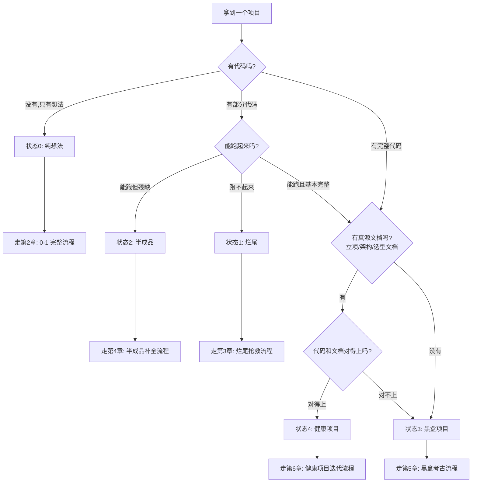
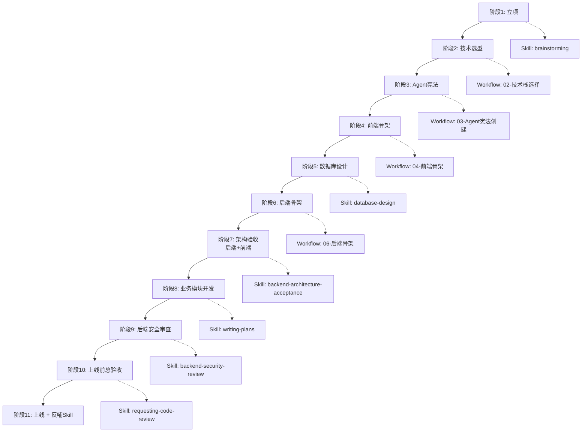
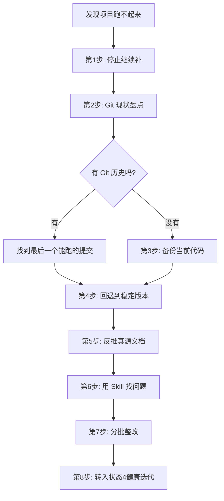
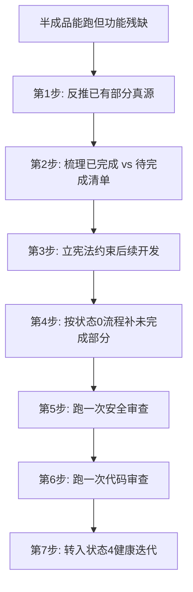
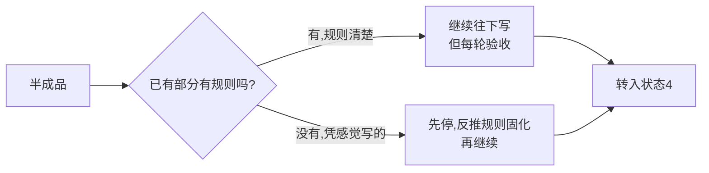
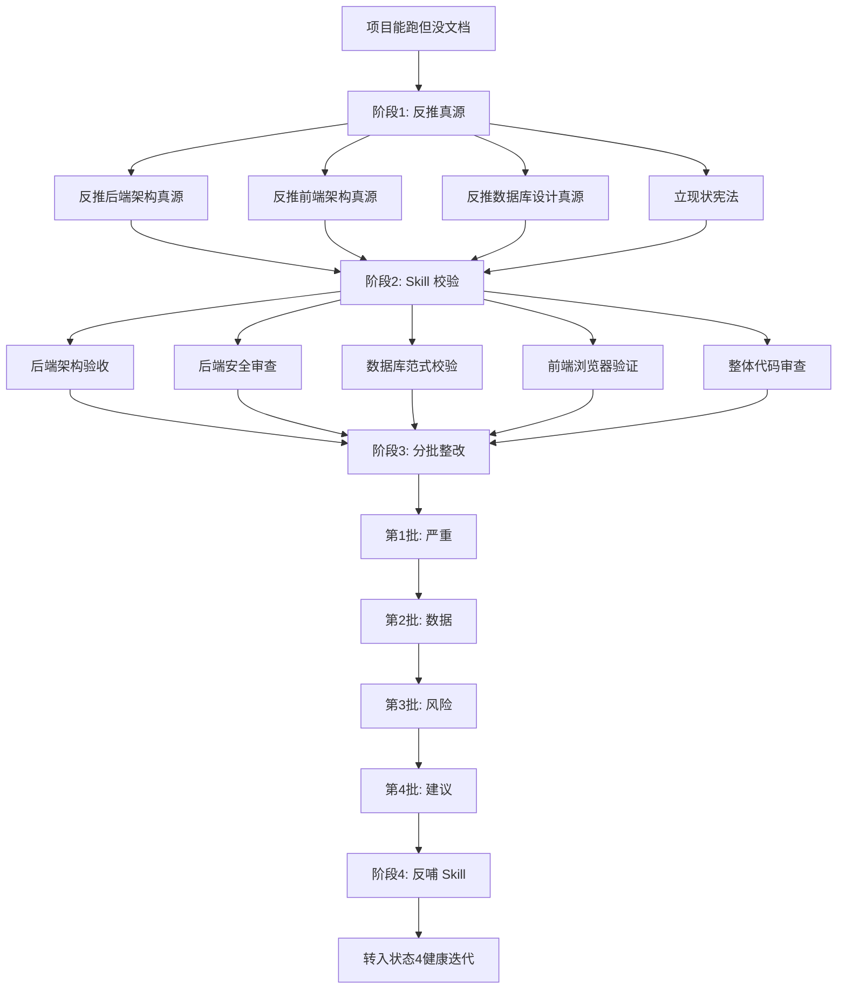
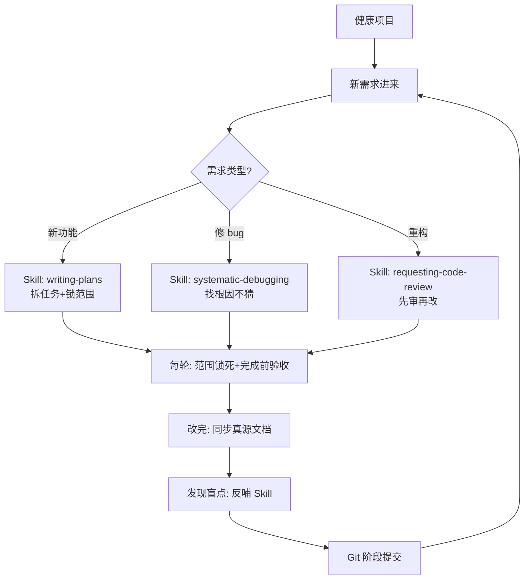
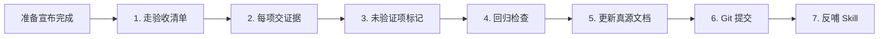
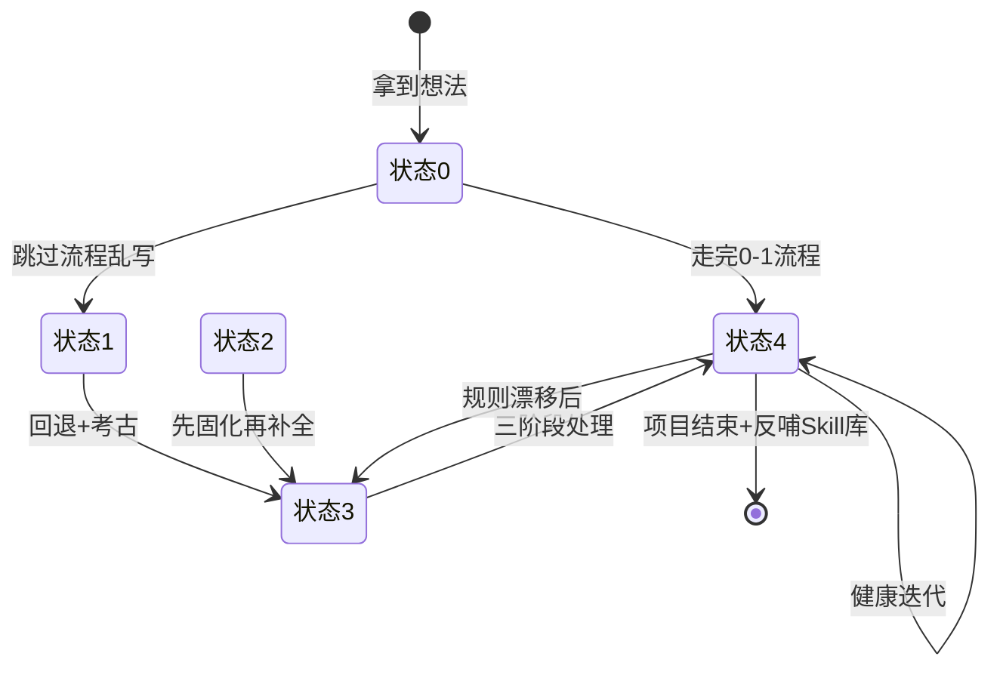

# Vibe Coding 项目可视化流程手册

> 适用场景：拿到一个项目，不知道从哪开始、走哪条路、每步该干什么。
> 用法：先看第一章判断项目状态 → 跳到对应章节 → 按流程图执行 → 每步参考"计划方向"卡片。

---

## 第一章：先判断项目处于什么状态

### 1.1 项目状态识别决策树



### 1.2 五种状态速查表

| 状态 | 特征 | 核心风险 | 起点章节 |
|---|---|---|---|
| **状态 0**：纯想法 | 只有脑子里的方向，没代码没文档 | AI 自由发挥、方向漂移 | 第 2 章 |
| **状态 1**：烂尾 | 有代码但跑不起来 | 越补越乱、改坏不可逆 | 第 3 章 |
| **状态 2**：半成品 | 能跑但功能残缺 | 范围失控、规则未立 | 第 4 章 |
| **状态 3**：黑盒 | 能跑但没文档或文档对不上 | AI 凭猜测改、必然漂移 | 第 5 章 |
| **状态 4**：健康 | 能跑、有文档、文档对得上 | 停滞迭代、Skill 不反哺 | 第 6 章 |

> **判断窍门**：90% 的"已完成项目"实际是状态 3（黑盒），不是状态 4。先按状态 3 走考古流程，别直接进迭代。

---

## 第二章：状态 0 — 纯想法（0-1 完整流程）

### 2.1 完整流程图



### 2.2 每阶段计划方向卡片

#### 📍 阶段 1：立项（1-2 轮对话）

| 项目 | 内容 |
|---|---|
| **目标** | 把模糊想法变成可执行立项文档 |
| **触发 Skill** | `brainstorming.md` + Prompt模板库套路 A |
| **关键约束** | 不写代码、不装依赖、只讨论 |
| **产出** | 立项文档（8 项内容：立项说明 / 功能边界 / 流程路径 / 业务对象 / 技术路线 / 爆点差异 / 后期规划 / 验收规则） |
| **Git 提交** | `chore: 完成项目立项` |
| **判断通过** | AI 确认"暂时不写代码" + 立项文档已落地 |
| **常见坑** | 跳过讨论直接让 AI 装依赖建项目 |

#### 📍 阶段 2：技术选型（1 轮对话）

| 项目 | 内容 |
|---|---|
| **目标** | 把技术路线钉死，不让后续摇摆 |
| **触发 Workflow** | `02-技术栈选择流程.md` |
| **关键约束** | 必须给唯一推荐，不要列多方案 |
| **产出** | 技术选型文档（前端框架+UI库 / 后端语言+框架 / 数据库 / 主要 SDK / 选和不选的理由） |
| **Git 提交** | `chore: 确定项目技术栈` |
| **判断通过** | AI 能说清"为什么不选其他方案" |
| **常见坑** | 让 AI 列 3 套方案让你选（甩锅） |

#### 📍 阶段 3：Agent 宪法（1 轮对话）

| 项目 | 内容 |
|---|---|
| **目标** | 给 AI 立长期规矩，让它稳定不漂移 |
| **触发 Workflow** | `03-Agent宪法创建流程.md` |
| **关键约束** | 短、硬、清楚；只写长期原则；含禁止事项和验收标准 |
| **产出** | `AGENT_CONSTITUTION.md` + 各 IDE 入口文件（`AGENTS.md`/`CLAUDE.md`/`.trae/rules/`） |
| **Git 提交** | `chore: 创建项目 Agent 宪法` |
| **判断通过** | 宪法不超过几百行 + 含项目专属条款 |
| **常见坑** | 把所有技术细节、目录结构塞进宪法 |

#### 📍 阶段 4：前端骨架（1-2 轮对话）

| 项目 | 内容 |
|---|---|
| **目标** | 在写页面前先把统一规则定下来 |
| **触发 Workflow** | `04-前端骨架搭建流程.md` |
| **关键约束** | 先定设计 token / 组件库 / 目录规则；本轮只搭最小可运行骨架 |
| **产出** | 前端实施计划 + 能启动 / 首页能打开的骨架 |
| **Git 提交** | `feat: 搭建前端最小可运行骨架` |
| **判断通过** | 设计 token 已定、UI 组件库接入、能启动 |
| **常见坑** | 一次性做完所有页面、到处手写组件 |

#### 📍 阶段 5：数据库设计（1-2 轮对话）

| 项目 | 内容 |
|---|---|
| **目标** | 先设计文件再建表，不直接连库建表 |
| **触发 Skill** | `database-design.md` + `05-数据库设计流程.md` |
| **关键约束** | 先 schema/migration 后执行；三大范式校验 |
| **产出** | `schema.sql` / migration + 数据库实施计划 |
| **Git 提交** | `feat: 完成数据库设计文件并跑通基础结构` |
| **判断通过** | 能连接 / 能建表 / 能插入和查询测试数据 |
| **常见坑** | 直接连库建表、密码明文、金额用浮点 |

#### 📍 阶段 6：后端骨架（1-2 轮对话）

| 项目 | 内容 |
|---|---|
| **目标** | 先写架构文档再搭骨架，避免规则漂移 |
| **触发 Workflow** | `06-后端骨架搭建流程.md` |
| **关键约束** | 必须先有《项目架构设计文档》再写代码 |
| **产出** | 项目架构设计文档 + 最小可运行后端骨架 |
| **Git 提交** | `feat: 搭建后端最小可运行骨架` |
| **判断通过** | 启动线 / 接口线 / 业务线 / 运维线四条线跑通 |
| **常见坑** | 跳过架构文档直接写代码、一上来写完整业务 |

#### 📍 阶段 7：架构验收（后端+前端）（1-2 轮对话）

| 项目 | 内容 |
|---|---|
| **目标** | 用证据证明规则立住了，不是听 AI 说"已完成"。后端+前端分别验收 |
| **触发 Skill** | `backend-architecture-acceptance.md` + `browser-verification.md` |
| **关键约束** | 每项交证据（文件/命令/输出/日志/截图），未验证项标记"未验证" |
| **产出** | 验收报告 + 《后端架构实施真源文档》+ 《前端架构实施真源文档》 |
| **Git 提交** | `chore: 架构验收通过，固化实施真源文档` |
| **判断通过** | 后端 11 种接口场景齐全 + 前端设计 token 生效 + 浏览器验证通过 |
| **常见坑** | 听"已完成"就放过、只验后端不验前端、把细则塞进宪法 |

#### 📍 阶段 8：业务模块开发（多轮，一个模块一轮）

| 项目 | 内容 |
|---|---|
| **目标** | 一个模块一个模块加，每轮交付可验收小块 |
| **触发 Skill** | `writing-plans.md` + Prompt模板库套路 C/D/E |
| **关键约束** | 每轮锁死范围；完成前必须走验收清单 |
| **产出** | 业务接口 + 每轮 Git 提交 |
| **Git 提交** | `feat: 完成 XX 模块（含 XX 接口）` |
| **判断通过** | 每轮验收清单 7 项全过 |
| **常见坑** | 一口气写完所有业务、跳过每轮验收 |

#### 📍 阶段 9：后端安全审查（1-2 轮对话）

| 项目 | 内容 |
|---|---|
| **目标** | 把 5 道安全关卡逐项交证据 |
| **触发 Skill** | `backend-security-review.md` + `08-后端安全审查流程.md` + Prompt模板库套路 F |
| **关键约束** | 重点查水平越权 + 注入；看不懂的说明不合格 |
| **产出** | 安全边界表 + 权限设计表 + 整改清单 |
| **Git 提交** | `chore: 后端安全审查通过` |
| **判断通过** | 5 道关卡全过、无字符串拼接用户输入 |
| **常见坑** | 只做"要不要登录"忽略水平越权 |

#### 📍 阶段 10：上线前总验收（1-2 轮对话）

| 项目 | 内容 |
|---|---|
| **目标** | 上线前最后一次系统检查 |
| **触发 Skill** | `requesting-code-review.md` + `browser-verification.md` + Prompt模板库套路 H |
| **关键约束** | 5 维度审查（结构/规则/安全/数据/可维护性）+ 风险分级 |
| **产出** | 代码审查报告 + 整改清单 |
| **Git 提交** | `chore: 上线前总验收通过` |
| **判断通过** | 无 🔴 严重项 |
| **常见坑** | 跳过总验收直接上线 |

#### 📍 阶段 11：上线 + 反哺 Skill

| 项目 | 内容 |
|---|---|
| **目标** | 上线 + 把本次踩的坑反哺到 Skill 库 |
| **关键动作** | 整理本次项目的盲点 → 改进对应 Skill |
| **产出** | 迭代后的 Skill 库（这是复利的关键） |
| **Git 提交** | 个人 Skill 库的 commit |
| **判断通过** | 至少反哺 1 条新经验到 Skill |
| **常见坑** | 上线完就结束，Skill 没迭代 |

---

## 第三章：状态 1 — 烂尾抢救流程

### 3.1 抢救流程图



### 3.2 每步计划方向

#### 📍 第 1 步：停止继续补（最重要）

**为什么**：AI 越补越乱是 Vibe Coding 最常见的灾难。让它停比让它继续补成本低 10 倍。

**怎么说**：

```
停。当前改动已经偏离目标。请先列出最近 3 次 Git 提交，告诉我每个版本做了什么。
我决定回退到哪个版本后，再重新开始这一轮。
```

#### 📍 第 2 步：Git 现状盘点

```
请执行：
1. git log --oneline -20  看最近 20 次提交
2. git status  看当前工作区状态
3. git diff --stat  看未提交改动规模
告诉我：当前能跑的最近版本是哪个？工作区有多少未提交改动？
```

#### 📍 第 3 步：备份（无 Git 时必做）

```bash
# 复制整个项目目录到 _backup_日期
cp -r 项目目录 项目目录_backup_20260629
```

**没 Git 就没法回退**——这也是为什么 Git 是 Vibe Coding 的后悔药。

#### 📍 第 4 步：回退到稳定版本

```
请帮我回退到 [commit-id]。
说明：回退后会丢失哪些改动？是否需要先 stash 当前未提交改动？
回退方式用 git reset --hard 还是 git checkout？给建议。
```

#### 📍 第 5-8 步：转入状态 3 流程

回退到能跑的版本后，按"状态 3 黑盒考古流程"走（第 5 章），把规则固化下来再继续。

---

## 第四章：状态 2 — 半成品补全流程

### 4.1 补全流程图



### 4.2 关键决策点

**半成品最危险的决策**：是继续往下写，还是先停？



> 90% 的半成品是"凭感觉写的"，应该走 D 路径——先固化再继续，否则越写越乱。

---

## 第五章：状态 3 — 黑盒考古流程（已完成项目最常见）

### 5.1 考古流程图



### 5.2 三阶段计划方向

#### 📍 阶段 1：反推固化（不整改）

**核心**：让 AI 读代码反推规则，写成真源文档。这一步不改任何代码。

**为什么不能跳**：直接校验会让 AI 用通用标准乱挑，挑的你不需要、需要的它挑不到。

**三个反推指令**（直接贴进 Claude Code）：

```
请阅读后端代码，反推并生成《后端架构实施真源文档》。不要改任何代码。
包含：语言框架 / 目录责任表 / 接口响应规则 / 错误处理 / 日志 / 数据库连接 / 权限入口 / 框架复用边界 / 新增模块规则 / 启动证据包。
每项给文件路径 + 行号作为证据。说不清的标记"未明确"。
```

```
请阅读前端代码，反推并生成《前端架构实施真源文档》。不要改任何代码。
包含：框架+UI库 / 设计风格 / 目录结构 / 设计token / 多语言主题 / 组件复用规则 / 路由 / 接口层 / 状态管理。
每项给文件路径作为证据。
```

```
请阅读数据库 schema / migration，反推并生成《数据库设计真源文档》。不要改任何代码。
包含：数据库服务 / 业务对象 / 对象关系 / 核心表 / 字段规范 / 软删除策略 / 三大范式校验。
每项给 schema 文件 + 行号作为证据。
```

#### 📍 阶段 2：Skill 校验（不整改）

固化完才能校验。5 个 Skill 跑一遍，输出整改清单：

| 顺序 | Skill | 关注重点 |
|---|---|---|
| 1 | `backend-architecture-acceptance` | 目录责任、11 种接口场景、框架复用 |
| 2 | `backend-security-review` | 5 道关卡、水平越权、注入 |
| 3 | `database-design` | 三大范式、密码哈希、金额浮点 |
| 4 | `browser-verification` | 设计 token、组件复用、跨端单位 |
| 5 | `requesting-code-review` | 5 维度审查、风险分级 |

#### 📍 阶段 3：分批整改 + 反哺

按严重度分批改，每批改完回归一次，改完同步真源文档，发现盲点反哺 Skill。

详见前面回复中"阶段三：分批整改"。

---

## 第六章：状态 4 — 健康项目迭代流程

### 6.1 迭代流程图



### 6.2 健康项目持续复利的 4 条规则

1. **每个新需求先拆计划**：用 `writing-plans.md`，不直接写代码
2. **每轮交付必走验收**：用 `verification-before-completion.md`，禁止"已完成"
3. **规则变更同步真源**：改了规则不改文档 = 下次 AI 又按旧规则写
4. **盲点反哺 Skill**：不改的 Skill 用 100 次也不会变强

---

## 第七章：跨状态通用规则

### 7.1 每次对话的开场模板


**模板**：

```
当前阶段：[立项 / 选型 / 前端 / 数据库 / 后端 / 业务 / 验收 / 调试]
你的角色：[产品合伙人 / 架构顾问 / 代码审查员 / 调试员]
上下文：[贴立项/选型/真源文档]
约束：给唯一推荐，不要列多方案
本轮范围：只做 [具体任务]，不一次性做完
验收标准：[具体可检查标准]
```

### 7.2 每次对话的收尾模板



### 7.3 项目状态转移图



---

## 第八章：快速查阅表

### 8.1 状态 → 起点章节 → 首要动作

| 状态 | 起点 | 第一步做什么 |
|---|---|---|
| 0 纯想法 | 第 2 章 | 用 `brainstorming` 跑立项 |
| 1 烂尾 | 第 3 章 | 停止补，先 Git 盘点 |
| 2 半成品 | 第 4 章 | 反推已有部分真源 |
| 3 黑盒 | 第 5 章 | 反推三份真源文档 |
| 4 健康 | 第 6 章 | 每个需求先拆计划 |

### 8.2 阶段 → Skill/Prompt 速查

| 阶段 | Skill | Workflow | Prompt 套路 |
|---|---|---|---|
| 立项 | brainstorming | 01 | A |
| 选型 | - | 02 | B |
| 宪法 | - | 03 | - |
| 计划 | writing-plans | - | C |
| 前端骨架 | - | 04 | D |
| 数据库 | database-design | 05 | - |
| 后端骨架 | - | 06 | - |
| 后端验收 | backend-architecture-acceptance | 07 | - |
| 业务开发 | verification-before-completion | - | D, E |
| 安全审查 | backend-security-review | 08 | F |
| 调试 | systematic-debugging | - | G |
| 代码审查 | requesting-code-review | - | H |
| 前端验收 | browser-verification | - | - |
| Git 提交 | - | 09 | - |

### 8.3 一句话心法（贴在显示器上）

> **AI 没记忆 → 文档是它的记忆**
> **AI 默认动手 → 你要逼它先想**
> **AI 默认讨好 → 你要逼它给判断**
> **AI 默认结论 → 你要逼它给证据**
> **AI 默认前进 → 你要逼它会停**
> **AI 会偷懒 → 一句话甩过去它就脑补，必须给够上下文和约束**

---

## 使用建议

1. **每个新项目开始前**：先翻第 1 章判断状态，再跳对应章节
2. **每个阶段开始前**：翻对应"计划方向卡片"，确认目标/约束/产出/验收
3. **每次对话开始前**：用第 7.1 节开场模板
4. **每次对话收尾前**：用第 7.2 节收尾模板
5. **每三个月回看一次**：项目状态是否在向状态 4 演进，Skill 库是否在迭代
